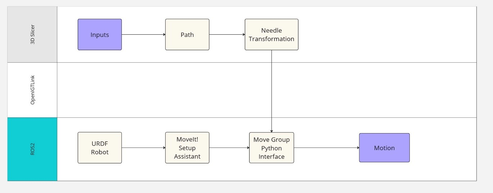

# Image Navigation System for Surgical Robots

This is a course assignment project that calculates the optimal trajectory for needle insertion in 3D Slicer. It then commands a ROS robot model to perform the action.




This program is designed for and only tested on a fake brain dataset specific for my course. However, in theory it should also works in other senarios if the input is in the right format. The program requires two `vtkMRMLMarkupsFiducialNode` instances as the entry and target candidate respectively, as well as two `vtkMRMLLabelMapVolumeNode` instances representing critical structures (e.g., blood vessels) to be avoided. The algorithm will return a `vtkMRMLLinearTransformNode`, which you need to push into the ROS environment using OpenIGTLink.

## Instructions

### Step 1
1. Open 3D Slicer.
2. Import your entries, targets, vessels, and ventricles.
3. In the Python terminal, run the following commands:
```python
exec(open(your_path/PathPlanning.py').read())  
best_path, max_d = findpath('entries_name', 'targets_name', 'vessels_name', 'ventricles_name', max_length=infinity, scale_rate=1)
```
   - You can set `max_length` to any value and `scale_rate` to any integer.
   - Note: A larger `scale_rate` can result in a significant performance loss.
   - __Warning__: The `findpath()` function uses all available CPU threads for concurrency. While this can speed up the calculation, it may also freeze your computer temporarily, for a period of minutes or even hours. This is normal and you should not force quit 3D Slicer during this process.
```python
gettransform('entry', 'target', patient_position=[0,0,0])
```
   - You can set a different `patient_position` for a better path.

4. Open OpenIGTLinkIF and establish a connection with the Ubuntu machine running ROS.

### Step 2
1. Construct a ROS workspace and place the `MyBot` folder within this space.
2. Open a terminal and run the following commands:
```bash
source your_workspace_path/devel/setup.bash  
roslaunch MyBot demo.launch
```
3. Open another terminal and run the following commands:
```bash
source your_workspace_path/devel/setup.bash  
rosrun MyBot PoseGoal0.2.py
```
4. Follow the instructions in the terminal. You should be able to observe the movement in RViz, the window opened in Step 2.2.

Please remember to replace the placeholders (e.g., 'your_path', 'entries_name', etc.) with your actual values before using these instructions.

For detailed description of this project, please refer to the `Image-guided Robotic Navigation Final Report.pdf` file under the root directory.
